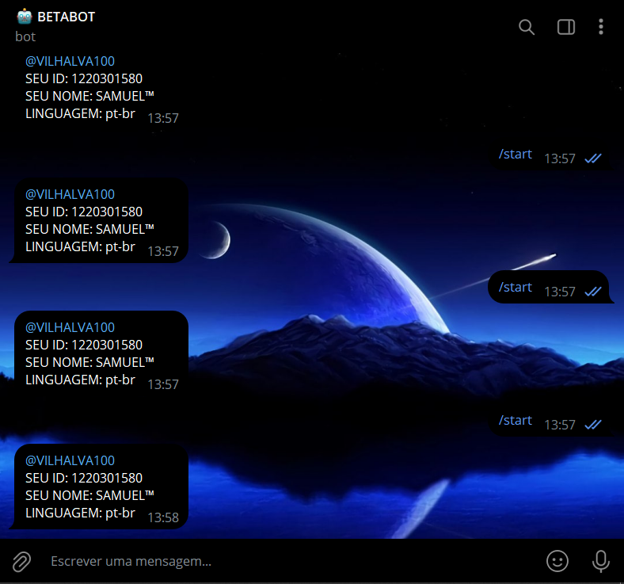

# USER INFO BOT
🧑‍💻ENCONTRE O SEU ID E MAIS INFORMAÇÕES COM ESSE BOT DO TELEGRAM.

 <br>

## DESCRIÇÃO:
O bot captura mensagens enviadas pelos usuários (ou encaminhadas de canais) e responde com informações do usuário ou do canal. Dependendo do tipo de mensagem, ele pode retornar:
- **ID do usuário** (seu identificador único no Telegram)
- **Nome e sobrenome** do usuário
- **Nome de usuário (username)**, se disponível
- **Código de idioma** configurado no Telegram
- Caso a mensagem seja encaminhada de um canal, o bot informa o ID e título do canal, além de gerar um link para a mensagem original no canal (se o username do canal e o ID da mensagem estiverem disponíveis).

## FUNCIONALIDADES TECNICAS:
- **Webhook**: O bot recebe atualizações do Telegram via webhook. Quando o Telegram envia uma nova mensagem, o bot processa e envia uma resposta contendo informações do usuário ou canal.
- **Controle de duplicatas**: O código verifica se a mensagem atual é uma duplicata da última mensagem recebida, comparando o ID do remetente (`lastFrom`) e o ID do usuário/encaminhador (`lastId`). Se forem iguais, a mensagem é ignorada para evitar respostas duplicadas.
- **Mensagens encaminhadas**: Se a mensagem foi encaminhada de outro usuário ou canal, o bot tenta extrair as informações do usuário ou do canal original.

## EXECUTANDO O PROJETO:
1. **Obter o token e o ID de proprietário**:
   - Para usar esse bot, você precisa do **Token do bot**, que pode ser gerado pelo [@BotFather](https://t.me/BotFather) no Telegram.
   - Você também precisa do **seu ID de usuário** no Telegram. Para isso, use um bot como [INFO PRIVADO BOT](https://github.com/VILHALVA/INFO-PRIVADO-BOT) ou qualquer outro bot que forneça seu ID.

2. **Configurar o bot**:
   - No arquivo `BuildVars`, você deve substituir as variáveis `OWNER` e `TOKEN` pelos seus valores:
     ```java
     public static final int OWNER = SEU_ID_DE_USUÁRIO_AQUI;  // O ID do usuário proprietário
     public static final String TOKEN = "SEU_TOKEN_AQUI";     // O token do bot fornecido pelo BotFather
     ```

3. **Hospedar o webhook**:
   - O código é configurado para ser usado em um servidor web como um servlet. Quando uma atualização (mensagem) é enviada ao webhook, o método `doPost` do servlet é chamado, processando a atualização.
   
4. **Definir o webhook**:
   - Após hospedar o servlet, você precisa configurar o **webhook do Telegram** apontando para o URL do seu servidor. Use o método `setWebhook` da API do Telegram ou configure através de uma ferramenta de API como o Postman.

5. **Respostas do bot**:
   - Sempre que o bot receber uma mensagem, ele analisará quem enviou a mensagem e enviará as informações do usuário ou do canal de origem de volta ao usuário que interagiu com o bot.

## NÃO SABE?
- Entendemos que para manipular arquivos em muitas linguagens e tecnologias relacionadas, é necessário possuir conhecimento nessas áreas. Para auxiliar nesse aprendizado, oferecemos alguns subsidios:
* [VEJA A DOCUMENTAÇÃO](https://core.telegram.org/bots/api)
* [CURSO SUGERIDO](https://github.com/VILHALVA/CURSO-DE-TELEBOT)
* [CURSO DE JAVA](https://github.com/VILHALVA/CURSO-DE-JAVA)
* [CONFIRA MAIS CURSOS](https://github.com/VILHALVA?tab=repositories&q=+topic:CURSO)

## CREDITOS:
- [PROJETO CRIADO PELO "nadam"](https://github.com/nadam/userinfobot)
- [PROJETO EDITADO PELO VILHALVA](https://github.com/VILHALVA)

